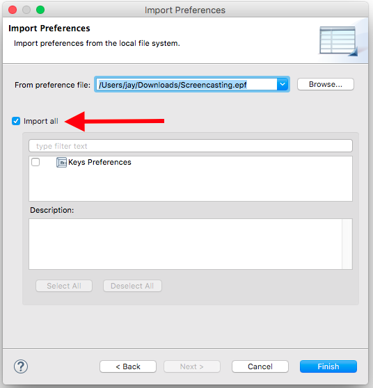

# `Screencasting.epf`

* Clone this repository to your workstation.
* From the menu, choose "File" -> "Import...".
* Expand the "General" group, and select "Preferences".
* Click "Next".

* Click "Browse..." and navigate to the `.epf` file in this folder.
* Select "Import all".
* Click "Finish".

Your editor fonts should now be increased in size for screencasting.

# `eclipse.ini`

Quit Eclipse. Then open your `Eclipse.app` as a directory and use this file in place of `Contents/Eclipse/eclipse.ini`. The important part is to remove the *two* (?!) lines with the text `-Dorg.eclipse.swt.internal.carbon.smallFonts`. Restart Eclipse, and the Package Explorer and other panes should be using a *slightly* larger font (though there is no known way to increase it to 18pt).
