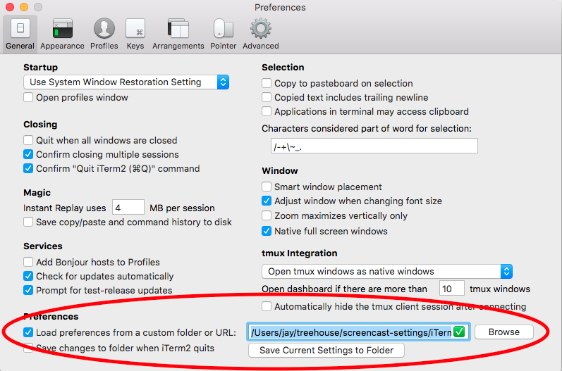

# Setup

* Clone this repository to your workstation.
* Open iTerm preferences.
* Enable "Load preferences from a custom folder or URL".
* Browse to this directory. (This directory contains a `com.googlecode.iterm2.plist` file, but there is no need to select the file directly, just the parent directory.)

* Restart iTerm.
* Choose "Open Profiles..." from the menu.
* Select the "Screencasting" profile.
* Click "New Window".

