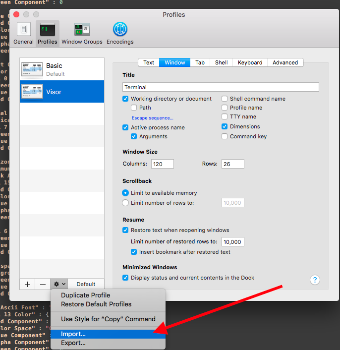

# Setup

* Clone this repository to your workstation.
* In Terminal preferences, click the "Profiles" tab.
* Click the Options menu (the gear icon) and choose "Import..."

* Navigate to the `Screencasting.terminal` file, and select it.
* From the main menu, choose "Shell" -> "New Window" -> "Screencasting".

